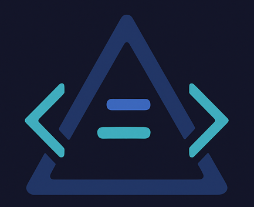

# DeltaVision Standalone Edition

This is the standalone edition of DeltaVision, designed for deployment in highly-restricted environments where installation of Docker, Podman, or even Node.js is not possible or permitted.



## Key Benefits

- **Zero Installation Required**: Everything needed is bundled, including a statically-compiled Node.js binary
- **Works Anywhere**: No dependencies on Docker, Podman, system libraries, or installation privileges
- **Offline Operation**: No internet connectivity required at any point
- **Small Footprint**: Minimal system resource requirements
- **Simple Usage**: Extract and run with a single command
- **Cross-Platform Support**: Available for Linux, macOS, and Windows on multiple architectures

## Getting Started

### Quick Start

1. **Extract the package**:
   ```bash
   unzip deltavision-standalone-1.0.0.zip
   cd deltavision-standalone-1.0.0
   ```

2. **Verify the package** (optional but recommended):
   ```bash
   ./scripts/verify-standalone.sh
   ```

3. **Start DeltaVision**:
   ```bash
   ./start-deltavision.sh /path/to/old/folder /path/to/new/folder [keywords.txt]
   ```

4. **Access the application**:
   Open your browser and navigate to:
   ```
   http://localhost:3000
   ```

### System Requirements

- Any Linux distribution with basic libraries (glibc)
- 2GB RAM recommended (512MB minimum)
- 200MB disk space plus space for your data
- Modern web browser (Chrome, Firefox, Edge, Safari)
- No root or administrator privileges required
- No internet connection required

### Supported Platforms

- Linux x64 (Most desktop/server distributions)
- Linux ARM64 (Raspberry Pi, AWS Graviton)
- macOS Intel x64
- macOS Apple Silicon (M1/M2/M3)
- Windows x64

## Files and Directories

- `start-deltavision.sh`: Main startup script
- `node/`: Contains the statically-compiled Node.js binary
- `app/`: Contains the DeltaVision application code
- `scripts/`: Helper scripts for verification and troubleshooting
- `docs/`: Documentation files
- `keywords.txt`: Default keywords file for highlighting

## Available Scripts

| Script | Purpose |
|--------|---------|
| `start-deltavision.sh` | Main script to start DeltaVision |
| `scripts/verify-standalone.sh` | Verify the package integrity |
| `scripts/help.sh` | Show help for all scripts |

## Using Custom Ports

By default, DeltaVision runs on port 3000. To use a different port:

```bash
PORT=8080 ./start-deltavision.sh /path/to/old/folder /path/to/new/folder
```

## Custom Keyword Highlighting

DeltaVision can highlight specific keywords in your files. Create a text file with keywords and their colors:

```
ERROR:red
WARNING:yellow
INFO:blue
TODO:orange
```

Then specify this file when starting DeltaVision:

```bash
./start-deltavision.sh /path/to/old/folder /path/to/new/folder /path/to/keywords.txt
```

## Troubleshooting

### Common Issues

1. **Permission errors**:
   ```bash
   chmod +x start-deltavision.sh
   chmod +x node/node
   chmod +x scripts/*.sh
   ```

2. **Binary compatibility issues**:
   If the Node.js binary doesn't run on your system, check architecture compatibility:
   ```bash
   file node/node
   ```
   This package includes a binary for x64 Linux systems. Contact us if you need a different architecture.

3. **Port already in use**:
   If port 3000 is already being used, specify a different port as shown above.

### Getting Help

Run the help script for comprehensive guidance:

```bash
./scripts/help.sh
```

## Security Information

DeltaVision is designed to be secure in restricted environments:

- No external connections are made
- Files are accessed in read-only mode
- No data is collected or transmitted
- The application runs with the same privileges as the user

## Support

If you encounter issues with this standalone package, please contact your administrator or reference the full documentation included in the `docs/` directory.

## For Developers

### Creating Packages for Different Platforms

DeltaVision uses precompiled Node.js binaries to support multiple platforms. If you're creating a standalone package:

1. **Prepare binaries for all platforms** (only needed once):
   ```bash
   ./scripts/prepare-precompiled-binaries.sh
   ```

2. **Create the standalone package**:
   ```bash
   ./scripts/package-standalone.sh
   ```

3. The package will automatically use the appropriate precompiled binary.

### Adding Support for New Platforms

To add support for a new platform:

1. Create a directory for your platform in `precompiled/node/`
2. Download the appropriate Node.js binary from https://nodejs.org/dist/
3. Extract and place the binary in your platform directory
4. Ensure the binary is executable (if applicable)

Then use `package-standalone.sh` to create your package as usual.
